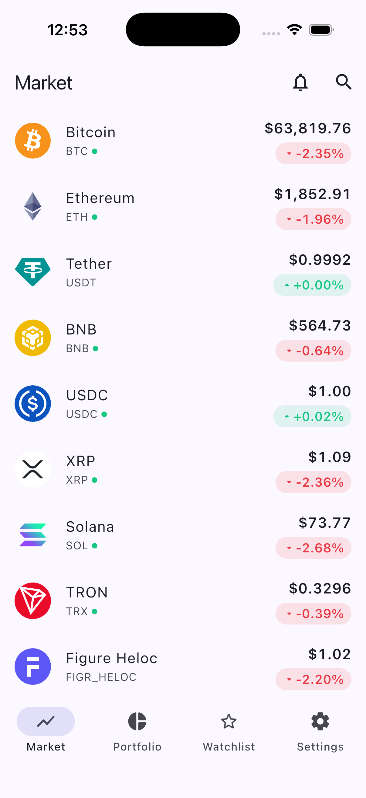
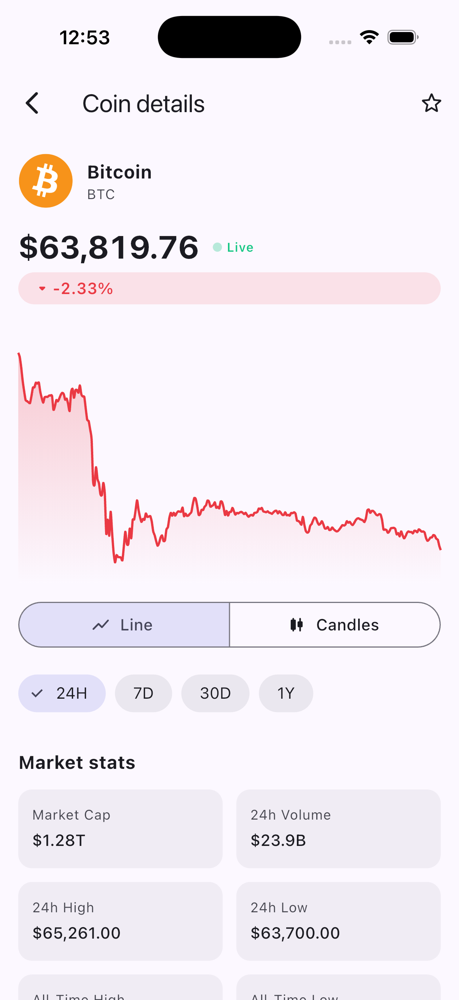
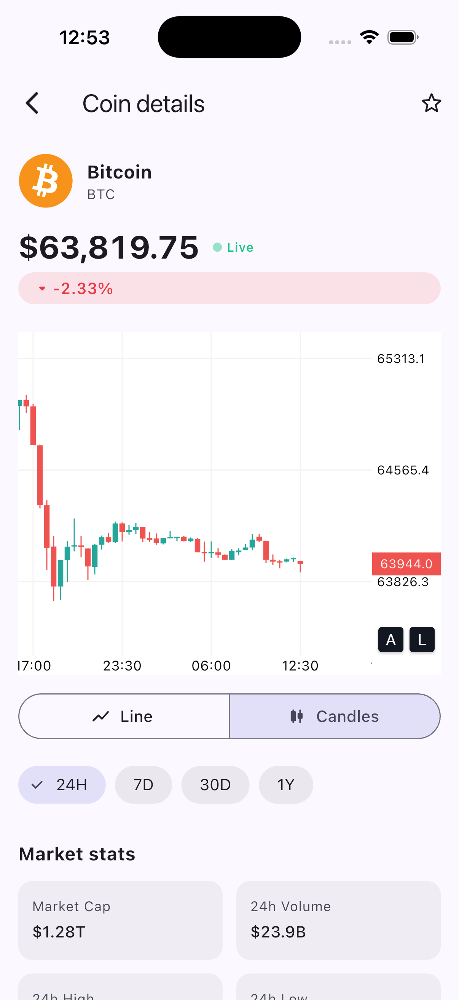
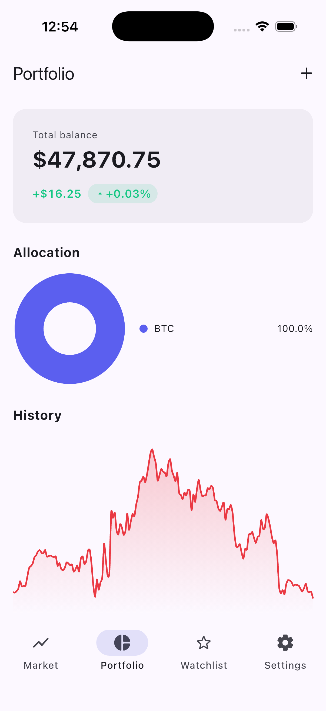
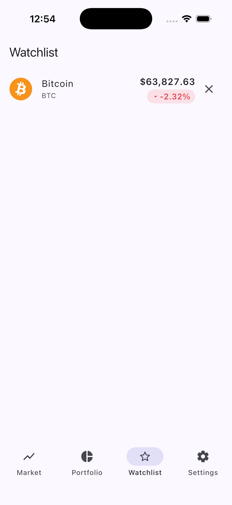
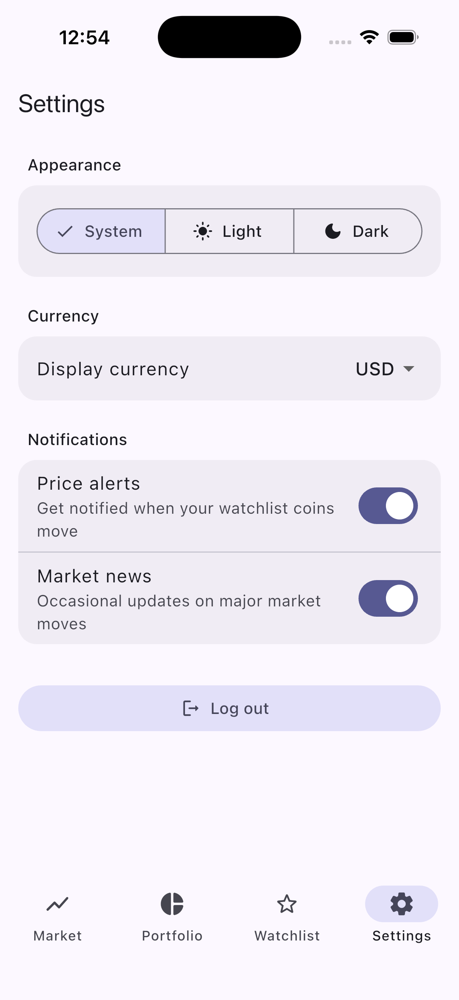
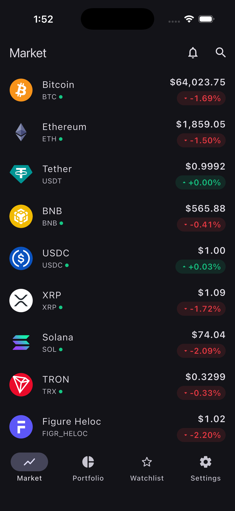
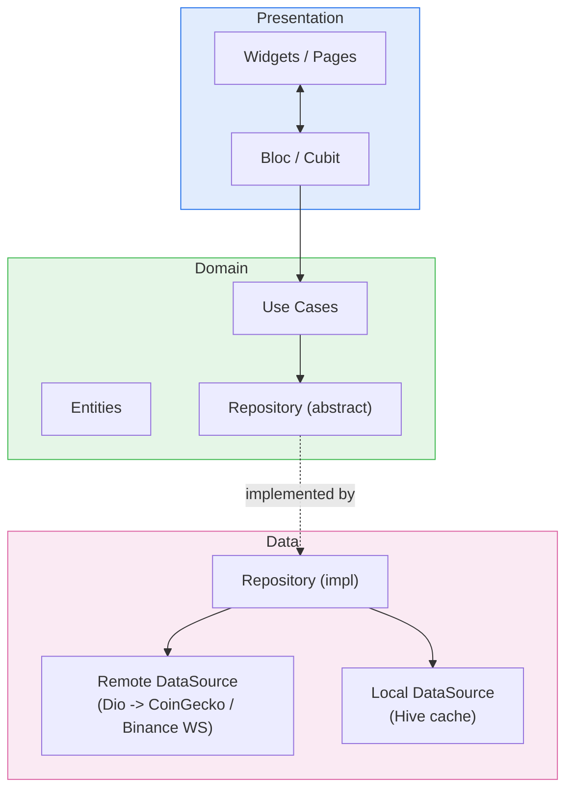

# Cryptofolio

A cryptocurrency portfolio & market tracker built with Flutter, showcasing production-grade
mobile architecture: feature-first Clean Architecture, BLoC state management, real-time price
streaming, offline-first caching, and full Firebase observability.

Live market data comes from the [CoinGecko](https://www.coingecko.com/en/api) REST API; live
price ticks stream over a public [Binance](https://binance-docs.github.io/apidocs/spot/en/#websocket-market-streams)
WebSocket.

## Screenshots

| Market | Coin detail (line) | Coin detail (candles) |
|---|---|---|
|  |  |  |

| Portfolio | Watchlist | Settings |
|---|---|---|
|  |  |  |

| Market (dark) |
|---|
|  |

### Supported platforms

iOS and Android only, by design — the app leans on platform Keychain/Keystore
session storage, native push notifications, and a bottom-nav mobile layout that
wouldn't translate to web/desktop without real rework. (`flutter create` scaffolds
web/desktop targets by default; they're intentionally untouched here.)

## Features

- **Authentication** — email/password sign-in against a mock backend, session persisted in the
  platform Keychain/Keystore via `flutter_secure_storage`, silent auto-login on relaunch.
- **Market** — paginated, searchable coin list with live-streamed prices, pull-to-refresh, and a
  coin detail screen with a line/candlestick chart toggle across multiple timeframes.
- **Portfolio** — track holdings with live P&L, allocation breakdown, and a value-over-time chart
  approximated from each held coin's price history.
- **Watchlist** — star coins from anywhere in the app; live-updating list backed by Hive.
- **Notifications** — Firebase Cloud Messaging + local notifications, with an in-app inbox for
  price alerts and market news.
- **Settings** — theme (light/dark/system), display currency, and notification preferences,
  reactive across the whole app.

## Architecture

Each feature is a self-contained vertical slice with its own `data` / `domain` / `presentation`
layers, isolated by feature so any one of them could be pulled out or worked on independently.
Cross-feature concerns (networking, DI, error handling, storage, theming) live in `core`.



The domain layer only depends on abstractions (`RepositoryIface`), never on `data`, so use cases
and blocs are unit-testable with a mocked repository and no Flutter/platform dependency at all.

**Error handling** flows uniformly through the stack as `Either<Failure, T>` (via `dartz`):
data sources throw typed exceptions, a repository maps them to a sealed `Failure` union, and the
presentation layer pattern-matches on `Failure` to render network/server/cache/validation-specific
UI (see `core/error` and `core/widgets/error_state_view.dart`).

**Real-time prices**: REST (CoinGecko) provides the authoritative snapshot; a shared Binance
WebSocket stream (owned by the Market feature) pushes live ticks that patch
`currentPrice`/`priceChangePercentage24h` on top of that snapshot in Market, Coin Detail,
Portfolio, and Watchlist simultaneously, deduplicated behind one connection with per-screen
subscribe/unsubscribe reference counting.

**Dependency injection** is a plain `GetIt` service locator, wired feature-by-feature — each
feature exposes a `registerXFeature(GetIt sl)` function called once from
`core/di/injection_container.dart` at startup.

## Tech stack

Each pick names the alternative it was weighed against, as a trade-off rather than a verdict:

| Concern | Choice | Why, over the alternative |
|---|---|---|
| State management | `flutter_bloc` (Bloc + Cubit) | Vs. Riverpod: both are solid choices, and Riverpod's compile-safe providers and lower boilerplate for simple cases are genuinely appealing. Bloc's edge here is the explicit Event→State stream, which pairs well with `bloc_test`'s "given this event, expect exactly this state sequence" style for testing async flows like pagination and retry-on-failure. It also integrates cleanly with `go_router`'s stream-based refresh for auth-driven route guards (via a small `Listenable` adapter). Bloc for multi-event flows (Market, Auth), the lighter Cubit for single-purpose state (Portfolio, Settings). |
| Immutable models | `freezed` | Vs. hand-written classes: generates `copyWith`/equality/pattern-matching for the event/state/failure unions, which is the boilerplate that rots fastest by hand as fields get added. (Exhaustiveness checking on `switch` itself comes from Dart's sealed classes — Freezed's job is generating the union variants cleanly.) |
| DI | `get_it` | Vs. annotation-based DI (`injectable`, Riverpod-as-DI): a plain service locator needs no code generation for wiring itself, so `injection_container.dart` stays fully readable without a build step — a reasonable trade against the compile-time safety those alternatives offer. |
| Networking | `dio` | Vs. the plain `http` package: this app needs a real interceptor pipeline (auth header injection, retry-with-backoff, error normalization to `Failure`, dev-only request logging) across many endpoints — `dio` has that built in; `http` would mean hand-rolling it. |
| Local persistence | `hive` | Vs. `sqflite`/`drift`: what's cached today (coin lists, holdings, watchlist, settings, notification history) is document-shaped, not relational, so Hive keeps it simple. That said, holdings could outgrow this if the app ever needs a real per-transaction ledger (see Future improvements) — at that point a relational store would be the better fit. |
| Functional error handling | `dartz` (`Either`) | Vs. throwing exceptions across layers: encourages explicit error propagation through `fold` instead of relying on `try/catch` as the primary control flow — it doesn't prevent a stray `throw` from a data-layer mapper, but it makes the intended path the explicit one. |
| Routing | `go_router` | Vs. `Navigator` 1.0/imperative routing: declarative, deep-link-ready, and `StatefulShellRoute.indexedStack` gives the four bottom-nav tabs independent navigation stacks (each tab keeps its own back-stack) for free. |
| Charts | `fl_chart` (line) + `candlesticks` (OHLC) | `fl_chart` covers the line/portfolio-history charts well but has no candlestick series, hence the second, narrowly-scoped package just for OHLC rather than hand-rolling candles on a `CustomPainter`. |
| Realtime | raw `web_socket_channel` to Binance | CoinGecko's free tier is REST-only, so live ticks need a separate streaming source; Binance's public ticker stream is free and keyless. Since it's USD(T)-denominated, it's explicitly gated off whenever the display currency isn't USD rather than mislabeling prices. |
| Observability | Firebase Crashlytics + Analytics + Messaging | Vs. separate services per concern: one SDK, one project, each wrapped behind a small interface (`AnalyticsService`, `CrashReportingService`) with a no-op fallback, so tests and a Firebase-less dev setup don't need to know it exists. |

## Project structure

```
lib/
  core/                   # Shared across every feature
    config/               # Flavors, env loading
    di/                   # GetIt bootstrap
    error/                # Failure union, exception mapping
    network/              # Dio client + interceptors
    router/                # go_router config, app shell
    services/              # Analytics/crash reporting interfaces, CurrencyProvider
    storage/                # Hive box registry, secure token storage
    theme/                  # Material 3 theme, spacing/text-style scales
    widgets/                # Shared empty/error/skeleton state views
  features/
    authentication/
    market/
    portfolio/
    watchlist/
    notifications/
    settings/
      data/                 # Models, local/remote data sources, repository impl
      domain/               # Entities, repository interface, use cases
      presentation/         # Bloc/Cubit, pages, widgets
test/                      # Unit + widget tests, mirrors lib/ structure
integration_test/          # End-to-end flows driven on a real device/simulator
```

## Getting started

### Prerequisites

- Flutter 3.9+ (Dart 3.12+)
- An iOS simulator or Android emulator/device
- A [Firebase](https://firebase.google.com) project (for Crashlytics/Analytics/Messaging) — the
  app runs fine without one too, falling back to no-op observability services

### Setup

```bash
git clone <this-repo>
cd crypto_portfolio_tracker
flutter pub get

# Environment config
cp assets/env/.env.example assets/env/.env.development
cp assets/env/.env.example assets/env/.env.production
# CoinGecko's free tier needs no API key - the defaults work out of the box.

# Firebase (optional - skip to run with no-op analytics/crashlytics/notifications)
dart pub global activate flutterfire_cli
flutterfire configure

# Generate freezed/json_serializable code
dart run build_runner build --delete-conflicting-outputs
```

### Run

```bash
flutter run -t lib/main_development.dart   # development flavor
flutter run -t lib/main_production.dart    # production flavor
```

## Testing

**111 unit/widget tests** (mocktail + bloc_test) covering every feature's domain use cases,
blocs/cubits, and a handful of core widgets, plus **4 end-to-end integration flows** (auth,
market, portfolio + watchlist, settings + notifications) driven on a real simulator.

```bash
flutter test                                                # unit + widget tests
flutter test integration_test/<file>.dart -d <device-id>    # a single e2e flow
```

Integration tests are written against `IntegrationTestWidgetsFlutterBinding` and exercise real
navigation, real Hive storage, and the real CoinGecko API (no mocking) — they're driven on an
iOS simulator/Android emulator rather than headless, since the app's live-price streaming and
platform Keychain integration aren't meaningfully testable in a browser environment.

## Future improvements

- Push a real backend behind Authentication instead of the mock data source
- Cost-basis-aware portfolio history (currently approximates value-over-time using *current*
  holdings against historical prices, not a true per-lot ledger)
- Widget/golden-image tests for chart rendering
- CI pipeline (analyze, test, build) on PR

## License

This project is open source and available for anyone to use as a learning reference
or portfolio starting point.
